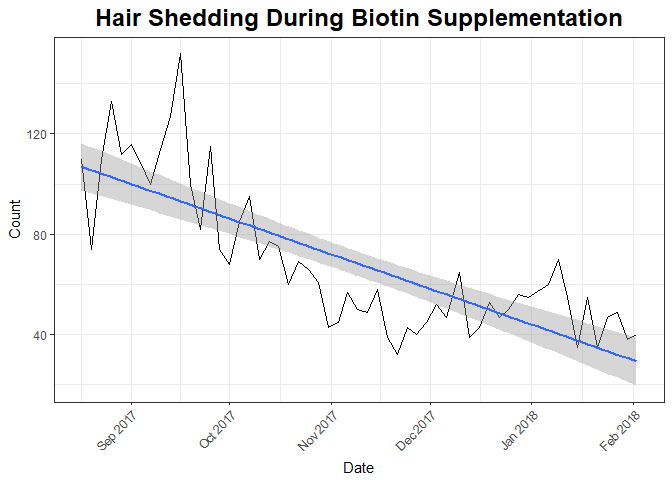
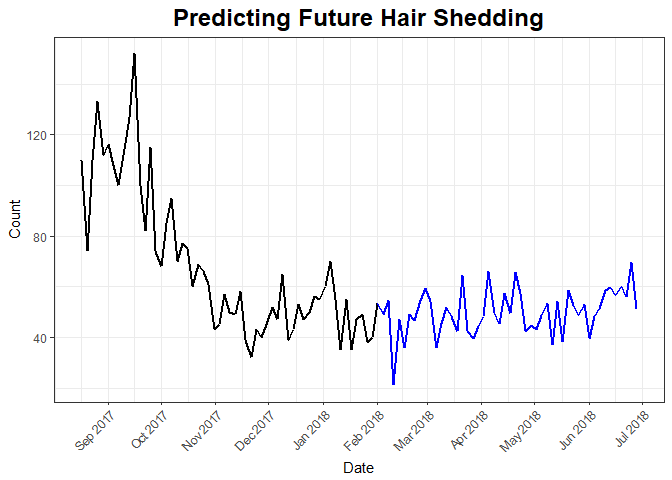
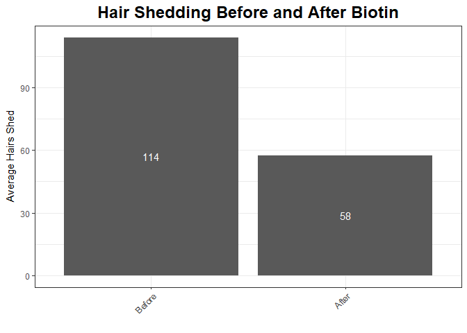

# Analysis of Biotin on Hair

#### Kory Becker - February 8, 2018

## Synopsis

This document is an analysis of the effects of the supplement [biotin](https://en.wikipedia.org/wiki/Biotin) (vitamin B7, also known as vitamin H or coenzyme R) on human hair.

The analysis includes a data-set of 60 measurements of human hair shedding counts while taking a daily dosage of the supplement biotin. The results show a distinct reduction in hair shedding over the time-period of the study. The maximum and average shedding counts per three-day period were reduced, with a total average reduction of 50%. Additionally, it was noted that the condition and quality of finger nails had strengthened.

## Background

Biotin is a dietary vitamin supplement generally recommended for its effects in strengthening hair and nails and improving the condition of skin. Scientific data to support the effects of biotin on hair, nails, and skin has generally shown weak or inconclusive effectiveness.

## Data Processing

The data source comes from a sampling of 60 entries of human hair-shedding, taken every 3 days, over a period of 5 months and 24 days (177 days). Each sampling was obtained after a shower and hair-wash with conditioner, with the washing occurring before each sampling period.

Initial biotin dosage began at 150 mcg (50% DV) during the first 2 weeks. The dosage was then increased to 300 mcg (100% DV) for the remainder of the study period. The data [file](https://raw.githubusercontent.com/primaryobjects/biotin/master/data.tsv) can be processed as shown below. Full source code for this analysis is available [online](https://github.com/primaryobjects/biotin).


```r
# Read data.
data <- read.csv('data.tsv', sep='\t', header = F, row.names = NULL, stringsAsFactors = FALSE)

# Set column names.
names(data) <- c('date', 'count', 'comment')

# Set date and month column.
data$date <- as.Date(data$date, '%m/%d/%Y')
data$month <- factor(format(data$date, format = "%B"), levels = month.name)

startDate <- as.Date('8/17/2017', '%m/%d/%Y')

# Discard first rows which were recorded earlier than every 3 days.
data <- subset(data, data$date >= startDate)
```

Note, we discard the first 3 recordings, as they were recorded at irregular intervals prior to 08/17/2017.

## Summary of Shedding Counts

We can view a general summary of hair shedding counts, including the minimum, maximum, and mean values as shown below.


```
##       date                count          comment                month
##  Min.   :2017-08-17   Min.   : 32.00   Length:56          October  :11
##  1st Qu.:2017-09-27   1st Qu.: 47.00   Class :character   September:10
##  Median :2017-11-07   Median : 59.00   Mode  :character   November :10
##  Mean   :2017-11-08   Mean   : 68.66                      December :10
##  3rd Qu.:2017-12-19   3rd Qu.: 82.75                      January  : 9
##  Max.   :2018-02-02   Max.   :152.00                      August   : 5
##                                                           (Other)  : 1
```


The maximum shedding count of 152 is found early within the biotin supplementation period on 09/16/2017. The minimum count of 32 occurred on 11/21/2017, while the mean count over the entire study duration is 68.6607143.

## Shedding Over Time

We can visualize the data with regard to hair shedding counts over time by plotting the data. The immediate outliers become apparent in the resulting graph. In particular, the first two months of data display distinctly higher values, with the peak count occurring on 09/16/2017. Biotin supplementation continued throughout this period. After the first two months, the counts of hair shedding notably decreases.

<!-- -->

*Figure 1. Visualizing shedding counts while using a daily vitamin supplementation of 300 mcg of biotin. The count of shedding during each recorded sampling has a notable decreasing trend-line over each 3 day period.*


```r
# Calculate a linear regression model.
fit <- lm(count ~ month, data)
summary(fit)$coefficients
```

```
##                 Estimate Std. Error    t value     Pr(>|t|)
## (Intercept)    49.333333   4.826469 10.2214126 9.681706e-14
## monthFebruary  -9.333333  15.262636 -0.6115152 5.436855e-01
## monthAugust    58.466667   8.076228  7.2393534 2.827050e-09
## monthSeptember 59.466667   6.652829  8.9385537 7.281074e-12
## monthOctober   20.575758   6.508010  3.1616052 2.691390e-03
## monthNovember  -3.533333   6.652829 -0.5311024 5.977471e-01
## monthDecember   1.366667   6.652829  0.2054264 8.380900e-01
```

We can examine a linear regression model of the data by calculating the count by month. The resulting model provides the mean difference in hair shedding counts on a monthly basis over the time of biotin supplementation. We can see that during the first month of August, the hair shedding count is greatest, with a mean value of 58. This continues into September with a mean value of 59. October begins the first significant decrease in hair shedding count, with a mean value of 21. From November through the remaining months in the recorded data, mean hair shedding counts begin to stabalaize with values of -4, 1, and -9.

## An Initial Increase Upon Starting Biotin

After beginning daily biotin supplementation, the data displays an increase in shedding counts during the first 31 days. We can visualize this notable change by separating the data leading up to the maximum count date on 09/16/2017 from the subsequent period.

<!-- -->

*Figure 2. An initial increase in shedding occurred during the first 31 days of biotin supplementation. After this initial period, shedding began decreasing over time.*

As the above graph displays, we can see an initial increase in shedding counts for the first 31 days of biotin supplementation. After this period, shedding decreases, continuing throughout biotin supplementation. The minimum recorded count is 32, recorded on 11/21/2017, 74 days prior to the end of the recorded data.

## Average Shedding Per Period

As we've separated an initial increasing period of shedding, after beginning biotin supplementation, from the subsequent decreasing period, it's interesting to note the distinct difference in average counts.


```r
period1Mean <- mean(data[data$date <= maxData$date, "count"])
period2Mean <- mean(data[data$date > maxData$date, "count"])
totalReductionPercent <- paste0(round((period2Mean / period1Mean) * 100), '%')
```

The average number of shedding during the initial "increasing" period of biotin supplementation is 114. The average number during the subsequent period of decreasing shedding is 58.

Using the two distinct periods, we can calculate a total percentage reduction in hair shedding over the course of the study as 50%.

## Forecasting Future Results

Using the historical data from the study, we can project future shedding counts using a forecast model to simulate data based on the past.

To reduce the variability in the predicted data, we'll base the forecasting off of the counts starting at 11/1/2017 through 02/02/2018. In this manner, our predicted future counts will be based off of the more relatively stable data, occurring after the initial drop after beginning biotin supplementation.


```r
library(forecast)

# Simulate based on the data occurring after relative stability.
realData <- subset(data, data$date >= as.Date('11/1/2017', '%m/%d/%Y'))

# Build a projection model.
futureFit <- ets(realData$count)

# Simulate future data for 50 entries.
simulatedFit <- simulate(futureFit, nsim=50, seed=117)
```

With the predicted values generated, we can calculate the average numbers of hair shedding for future dates, beyond our actual recorded data.


```
## [1] "Mean hair loss count in real data as of 11/1/2017"
```

```
## [1] 48.3
```

```
## [1] "Mean hair loss count in predicted data as of 2/5/2018"
```

```
## [1] 50.05
```


<!-- -->

*Figure 3. A prediction of future hair shedding counts. Real data (black) corresponds to historical data through 02/02/2018. Forecasted data (blue) predicts future counts from 02/05/2018 to 06/28/2018.*

## Supplementary Effects

In addition to the recorded data, it was also noted that the hair strands became thicker and the nails strengthened. Throughout each hair shedding count period, the shed hairs became less thin. By the end of the study period, the individual hairs appeared to be notably stronger and darker in color. These effects are highlighted in the list below.

- Reduction in hair shedding.
- Thickening of hair strands.
- Strengthening of finger nails.
- Less frequent nail tip breakage.

## Conclusion

Through the analysis of the hair shedding data, we can see a notable decrease in shedding over the recording period while taking biotin. There was an initial increase in shedding during the first 31 days of biotin supplementation, resulting in an average count during this initial period of 114 Shedding decreased over time following this period, resulting in an average count of 58 during the subsequent period. The maximum count of 152 was recorded 31 days into the study. The minimum count of 32 was recorded 74 days prior to the end of the study.

<!-- -->

*Figure 4. The average count of shedding while taking a daily dosage of biotin. The "before" column represents the first 30-days. The "after" column represents the later. A total mean reduction of shedding by 50% was achieved by the end of the study.*

## Sources

1. Biotin: Wikipedia *[[link]](https://en.wikipedia.org/wiki/Biotin)*

2. Biotin: MedlinePlus Supplements *[[link]](https://medlineplus.gov/druginfo/natural/313.html)*
